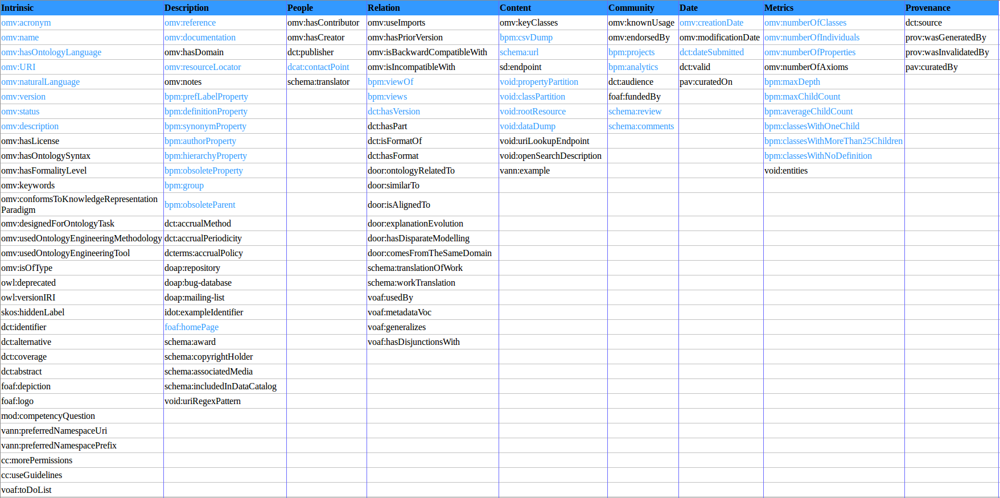

# Metadata for AgroPortal : Complete and Simplified List

### Specification Document June 2016

For any queries, **contact us** at **{toulet, jonquet, emonet}@lirmm.fr**  

## Abstract

This specification describes the complete list of metadata that can be supported in [AgroPortal](http://agroportal.lirmm.fr/), the ontology repository for agronomy.  
This list is consisted of properties we picked up in 21 vocabularies.  
We also present a simplified model that is implemented in AgroPortal and allows the management of any property outcome of our complete list.

## 1\. Vocabularies used

Scientific communities are using an increasing number of ontologies. Repositories enable to make them available. Now the question is how to find the ontology we need ? One solution is to describe each ontology with appropriate metadata. However, none of the existing metadata vocabularies can completely meet this need if taken independently. Based on our experience with the NCBO BioPortal, we have reviewed a large number of vocabularies, like Dublin Core, OMV, DCAT, VOID, etc.  

The following are the prefixes and XML Namespaces for the external metadata vocabularies used in our list.

**rdfs**: http://www.w3.org/2000/01/rdf-schema#  
**owl**: http://www.w3.org/2002/07/owl#  
**skos**: http://www.w3.org/2004/02/skos/core#  
**dc**: http://purl.org/dc/elements/1.1/  
**dcterms**: http://purl.org/dc/terms/  
**omv**: http://omv.ontoware.org/2005/05/ontology#  
**mod**: http://www.isibang.ac.in/ns/mod#  
**door**: http://kannel.open.ac.uk/ontology#  
**voaf**: http://purl.org/vocommons/voaf#  
**void**: http://rdfs.org/ns/void#  
**idot**: http://identifiers.org/idot/  
**vann**: http://purl.org/vocab/vann/  
**dcat**: http://www.w3.org/ns/dcat#  
**adms**: http://www.w3.org/ns/adms#  
**schema**: http://schema.org/  
**foaf**: http://xmlns.com/foaf/0.1/  
**doap**: http://usefulinc.com/ns/doap#  
**cc**:> http://creativecommons.org/ns#  
**prov**: http://www.w3.org/ns/prov#  
**pav**: http://purl.org/pav/  
**oboInOwl**: http://www.geneontology.org/formats/oboInOwl#  
**sd**: http://www.w3.org/ns/sparql-service-description#  
**cito**: http://purl.org/spar/cito/  
We use the prefix "bpm" for properties which are coming from the [NCBO BioPortal](http://bioportal.bioontology.org/).

## 2\. Complete List

Here is the complete list of selected properties which might be used to describe an ontology.

**rdfs**: [comment](https://www.w3.org/TR/rdf-schema/#ch_sumproperties) | [label](https://www.w3.org/TR/rdf-schema/#ch_sumproperties) | [seeAlso](https://www.w3.org/TR/rdf-schema/#ch_sumproperties)

**owl**: [backwardCompatibleWith](https://www.w3.org/TR/owl2-quick-reference/#Annotations) | [deprecated](https://www.w3.org/TR/owl2-quick-reference/#Annotations) | [imports](https://www.w3.org/TR/owl2-quick-reference/#Annotations) | [incompatibleWith](https://www.w3.org/TR/owl2-quick-reference/#Annotations) | [priorVersion](https://www.w3.org/TR/owl2-quick-reference/#Annotations) | [versionInfo](https://www.w3.org/TR/owl2-quick-reference/#Annotations) | [versionIRI](https://www.w3.org/TR/owl2-quick-reference/#Annotations)

**skos** : [altLabel](https://www.w3.org/TR/2008/WD-skos-reference-20080829/skos.html#altLabel) | [hasTopConcept](https://www.w3.org/TR/2008/WD-skos-reference-20080829/skos.html#hasTopConcept) | [hiddenLabel](https://www.w3.org/TR/2008/WD-skos-reference-20080829/skos.html#hiddenLabel) | [notation](https://www.w3.org/TR/2008/WD-skos-reference-20080829/skos.html#notation) | [prefLabel](https://www.w3.org/TR/2008/WD-skos-reference-20080829/skos.html#prefLabel)

**dc** : [contributor](http://dublincore.org/documents/2012/06/14/dcmi-terms/?v=elements#elements-contributor) | [coverage](http://dublincore.org/documents/2012/06/14/dcmi-terms/?v=elements#elements-coverage) | [creator](http://dublincore.org/documents/2012/06/14/dcmi-terms/?v=elements#elements-creator) | [date](http://dublincore.org/documents/2012/06/14/dcmi-terms/?v=elements#elements-date) | [description](http://dublincore.org/documents/2012/06/14/dcmi-terms/?v=elements#elements-description) | [format](http://dublincore.org/documents/2012/06/14/dcmi-terms/?v=elements#elements-format) | [identifier](http://dublincore.org/documents/2012/06/14/dcmi-terms/?v=elements#elements-identifier) | [language](http://dublincore.org/documents/2012/06/14/dcmi-terms/?v=elements#elements-language) | [publisher](http://dublincore.org/documents/2012/06/14/dcmi-terms/?v=elements#elements-publisher) | [relation](http://dublincore.org/documents/2012/06/14/dcmi-terms/?v=elements#elements-relation) | [rights](http://dublincore.org/documents/2012/06/14/dcmi-terms/?v=elements#elements-rights) | [source](http://dublincore.org/documents/2012/06/14/dcmi-terms/?v=elements#elements-source) | [subject](http://dublincore.org/documents/2012/06/14/dcmi-terms/?v=elements#elements-subject) | [title](http://dublincore.org/documents/2012/06/14/dcmi-terms/?v=elements#elements-title) | [type](http://dublincore.org/documents/2012/06/14/dcmi-terms/?v=elements#elements-type)

**dcterms** : [abstract](http://dublincore.org/documents/2012/06/14/dcmi-terms/?v=elements#terms-abstract) | [accessRights](http://dublincore.org/documents/2012/06/14/dcmi-terms/?v=elements#terms-accessRights) | [accrualMethod](http://dublincore.org/documents/2012/06/14/dcmi-terms/?v=elements#terms-accrualMethod) | [accrualPeriodicity](http://dublincore.org/documents/2012/06/14/dcmi-terms/?v=elements#terms-accrualPeriodicity) | [accrualPolicy](http://dublincore.org/documents/2012/06/14/dcmi-terms/?v=elements#terms-accrualPolicy) | [alternative](http://dublincore.org/documents/2012/06/14/dcmi-terms/?v=elements#terms-alternative) | [audience](http://dublincore.org/documents/2012/06/14/dcmi-terms/?v=elements#terms-audience) | [bibliographicCitation](http://dublincore.org/documents/2012/06/14/dcmi-terms/?v=elements#terms-bibliographicCitation) | [conformsTo](http://dublincore.org/documents/2012/06/14/dcmi-terms/?v=elements#terms-conformsTo) | [contributor](http://dublincore.org/documents/2012/06/14/dcmi-terms/?v=elements#terms-contributor) | [coverage](http://dublincore.org/documents/2012/06/14/dcmi-terms/?v=elements#terms-coverage) | [created](http://dublincore.org/documents/2012/06/14/dcmi-terms/?v=elements#terms-created) | [creator](http://dublincore.org/documents/2012/06/14/dcmi-terms/?v=elements#terms-creator) | [dateSubmitted](http://dublincore.org/documents/2012/06/14/dcmi-terms/?v=elements#terms-dateSubmitted) | [description](http://dublincore.org/documents/2012/06/14/dcmi-terms/?v=elements#terms-description) | [format](http://dublincore.org/documents/2012/06/14/dcmi-terms/?v=elements#terms-format) | [hasFormat](http://dublincore.org/documents/2012/06/14/dcmi-terms/?v=elements#terms-hasFormat) | [hasPart](http://dublincore.org/documents/2012/06/14/dcmi-terms/?v=elements#terms-hasPart) | [hasVersion](http://dublincore.org/documents/2012/06/14/dcmi-terms/?v=elements#terms-hasVersion) | [identifier](http://dublincore.org/documents/2012/06/14/dcmi-terms/?v=elements#terms-identifier) | [isFormatOf](http://dublincore.org/documents/2012/06/14/dcmi-terms/?v=elements#terms-isFormatOf) | [isPartOf](http://dublincore.org/documents/2012/06/14/dcmi-terms/?v=elements#terms-isPartOf) | [isVersionOf](http://dublincore.org/documents/2012/06/14/dcmi-terms/?v=elements#terms-isVersionOf) | [language](http://dublincore.org/documents/2012/06/14/dcmi-terms/?v=elements#terms-language) | [modified](http://dublincore.org/documents/2012/06/14/dcmi-terms/?v=elements#terms-modified) | [publisher](http://dublincore.org/documents/2012/06/14/dcmi-terms/?v=elements#terms-publisher) | [relation](http://dublincore.org/documents/2012/06/14/dcmi-terms/?v=elements#terms-relation) | [requires](http://dublincore.org/documents/2012/06/14/dcmi-terms/?v=elements#terms-requires) | [rights](http://dublincore.org/documents/2012/06/14/dcmi-terms/?v=elements#terms-rights) | [rightsHolder](http://dublincore.org/documents/2012/06/14/dcmi-terms/?v=elements#terms-rightsHolder) | [source](http://dublincore.org/documents/2012/06/14/dcmi-terms/?v=elements#terms-source) | [subject](http://dublincore.org/documents/2012/06/14/dcmi-terms/?v=elements#terms-subject) | [title](http://dublincore.org/documents/2012/06/14/dcmi-terms/?v=elements#terms-title) | [type](http://dublincore.org/documents/2012/06/14/dcmi-terms/?v=elements#terms-type) | [valid](http://dublincore.org/documents/2012/06/14/dcmi-terms/?v=elements#terms-valid)

**omv** : [acronym](http://omv2.sourceforge.net/description.html) | [creationDate](http://omv2.sourceforge.net/description.html) | [conformsToKnowledgeRepresentationParadigm](http://omv2.sourceforge.net/description.html) | [description](http://omv2.sourceforge.net/description.html) | [designedForOntologyTask](http://omv2.sourceforge.net/description.html) | [documentation](http://omv2.sourceforge.net/description.html) | [endorsedBy](http://omv2.sourceforge.net/description.html) | [hasContributor](http://omv2.sourceforge.net/description.html) | [hasCreator](http://omv2.sourceforge.net/description.html) | [hasDomain](http://omv2.sourceforge.net/description.html) | [hasFormalityLevel](http://omv2.sourceforge.net/description.html) | [hasLicense](http://omv2.sourceforge.net/description.html) | [hasOntologyLanguage](http://omv2.sourceforge.net/description.html) | [hasOntologySyntax](http://omv2.sourceforge.net/description.html) | [hasPriorVersion](http://omv2.sourceforge.net/description.html) | [isBackwardCompatibleWith](http://omv2.sourceforge.net/description.html) | [isIncompatibleWith](http://omv2.sourceforge.net/description.html) | [isOfType](http://omv2.sourceforge.net/description.html) | [keyClasses](http://omv2.sourceforge.net/description.html) | [keywords](http://omv2.sourceforge.net/description.html) | [knownUsage](http://omv2.sourceforge.net/description.html) | [modificationDate](http://omv2.sourceforge.net/description.html) | [name](http://omv2.sourceforge.net/description.html) | [naturalLanguage](http://omv2.sourceforge.net/description.html) | [notes](http://omv2.sourceforge.net/description.html) | [numberOfAxioms](http://omv2.sourceforge.net/description.html) | [numberOfClasses](http://omv2.sourceforge.net/description.html) | [numberOfIndividuals](http://omv2.sourceforge.net/description.html) | [numberOfProperties](http://omv2.sourceforge.net/description.html) | [reference](http://omv2.sourceforge.net/description.html) | [resourceLocator](http://omv2.sourceforge.net/description.html) | [status](http://omv2.sourceforge.net/description.html) | [URI](http://omv2.sourceforge.net/description.html) | [usedOntologyEngineeringMethodology](http://omv2.sourceforge.net/description.html) | [usedOntologyEngineeringTool](http://omv2.sourceforge.net/description.html) | [useImports](http://omv2.sourceforge.net/description.html) | [version](http://omv2.sourceforge.net/description.html)

**mod** : [accessibility](http://www.isibang.ac.in/ns/mod.html#module) | [acronym](http://www.isibang.ac.in/ns/mod.html#acronym) | [competencyQuestion](http://www.isibang.ac.in/ns/mod.html#competencyQuestion) | [creationDate](http://www.isibang.ac.in/ns/mod.html#creationDate) | [document](http://www.isibang.ac.in/ns/mod.html#document) | [endorsedBy](http://www.isibang.ac.in/ns/mod.html#endorsedBy) | [formalityLevel](http://www.isibang.ac.in/ns/mod.html#formalityLevel) | [homepage](http://www.isibang.ac.in/ns/mod.html#homepage) | [keyword](http://www.isibang.ac.in/ns/mod.html#keyword) | [KnowledgeRepresentationFormalism](http://www.isibang.ac.in/ns/mod.html#KnowledgeRepresentationFormalism) | [methodologyUsed](http://www.isibang.ac.in/ns/mod.html#methodologyUsed) | [module](http://www.isibang.ac.in/ns/mod.html#module) | [noOfAxioms](http://www.isibang.ac.in/ns/mod.html#noOfAxioms) | [noOfClasses](http://www.isibang.ac.in/ns/mod.html#noOfClasses) | [noOfIndividuals](http://www.isibang.ac.in/ns/mod.html#noOfIndividuals) | [noOfProperties](http://www.isibang.ac.in/ns/mod.html#noOfProperties) | [ontologyInUse](http://www.isibang.ac.in/ns/mod.html#ontologyInUse) | [ontologyDesignLanguage](http://www.isibang.ac.in/ns/mod.html#ontologyDesignLanguage) | [sponsoredBy](http://www.isibang.ac.in/ns/mod.html#sponsoredBy) | [syntax](http://www.isibang.ac.in/ns/mod.html#syntax) | [toolUsed](http://www.isibang.ac.in/ns/mod.html#toolUsed) | [version](http://www.isibang.ac.in/ns/mod.html#version) | [vocabularyUsed](http://www.isibang.ac.in/ns/mod.html#vocabularyUsed)

**door** : [backwardCompatibleWith](http://oro.open.ac.uk/24326/1/keod09.pdf) | [comesFromTheSameDomain](http://oro.open.ac.uk/24326/1/keod09.pdf) | [hasDisparateModelling](http://oro.open.ac.uk/24326/1/keod09.pdf) | [explanationEvolution](http://oro.open.ac.uk/24326/1/keod09.pdf) | [imports](http://oro.open.ac.uk/24326/1/keod09.pdf) | [isAlignedTo](http://oro.open.ac.uk/24326/1/keod09.pdf) | [ontologyRelatedTo](http://oro.open.ac.uk/24326/1/keod09.pdf) | [owlIncompatibleWith](http://oro.open.ac.uk/24326/1/keod09.pdf) | [priorVersion](http://oro.open.ac.uk/24326/1/keod09.pdf) | [semanticallyIncludedIn](http://oro.open.ac.uk/24326/1/keod09.pdf) | [similarTo](http://oro.open.ac.uk/24326/1/keod09.pdf)

**voaf** : [classNumber](http://lov.okfn.org/vocommons/voaf/v2.3/#classNumber) | [extends](http://lov.okfn.org/vocommons/voaf/v2.3/#extends) | [generalizes](http://lov.okfn.org/vocommons/voaf/v2.3/#generalizes) | [hasDisjunctionsWith](http://lov.okfn.org/vocommons/voaf/v2.3/#hasDisjunctionsWith) | [hasEquivalencesWith](http://lov.okfn.org/vocommons/voaf/v2.3/#hasEquivalencesWith) | [metadataVoc](http://lov.okfn.org/vocommons/voaf/v2.3/#metadataVoc) | [propertyNumber](http://lov.okfn.org/vocommons/voaf/v2.3/#propertyNumber) | [reliesOn](http://lov.okfn.org/vocommons/voaf/v2.3/#reliesOn) | [similar](http://lov.okfn.org/vocommons/voaf/v2.3/#similar) | [specializes](http://lov.okfn.org/vocommons/voaf/v2.3/#specializes) | [toDoList](http://lov.okfn.org/vocommons/voaf/v2.3/#toDoList) | [usedBy](http://lov.okfn.org/vocommons/voaf/v2.3/#usedBy)

**void** : [classes](http://vocab.deri.ie/void#classes) | [classPartition](http://vocab.deri.ie/void#classPartition) | [dataDump](http://vocab.deri.ie/void#dataDump) | [entities](http://vocab.deri.ie/void#entities) | [exampleResource](http://vocab.deri.ie/void#exampleResource) | [openSearchDescription](http://vocab.deri.ie/void#openSearchDescription) | [properties](http://vocab.deri.ie/void#properties) | [propertyPartition](http://vocab.deri.ie/void#propertyPartition) | [rootResource](http://vocab.deri.ie/void#rootResource) | [sparqlEndpoint](http://vocab.deri.ie/void#sparqlEndpoint) | [subset](http://vocab.deri.ie/void#subset) | [triples](http://vocab.deri.ie/void#triples) | [uriLookupEndpoint](http://vocab.deri.ie/void#uriLookupEndpoint) | [uriRegexPattern](http://vocab.deri.ie/void#uriRegexPattern) | [uriSpace](http://vocab.deri.ie/void#uriSpace) | [vocabulary](http://vocab.deri.ie/void#vocabulary)

**idot** : [alternatePrefix](http://biomodels.net/vocab/idot.rdf#alternatePrefix) | [exampleIdentifier](http://biomodels.net/vocab/idot.rdf#exampleIdentifier) | [identifierPattern](http://biomodels.net/vocab/idot.rdf#identifierPattern) | [obsolete](http://biomodels.net/vocab/idot.rdf#obsolete) | [preferredPrefix](http://biomodels.net/vocab/idot.rdf#preferredPrefix) | [state](http://biomodels.net/vocab/idot.rdf#state)

**vann** : [changes](http://vocab.org/vann/#changes) | [example](http://vocab.org/vann/#example) | [preferredNamespacePrefix](http://vocab.org/vann/#preferredNamespacePrefix) | [preferredNamespaceUri](http://vocab.org/vann/#preferredNamespaceUri) | [usageNote](http://vocab.org/vann/#usageNote)

**dcat** : [keyword](https://www.w3.org/TR/vocab-dcat/#Property:dataset_keyword) | [theme](https://www.w3.org/TR/vocab-dcat/#Property:dataset_theme) | [contactPoint](https://www.w3.org/TR/vocab-dcat/#Property:dataset_contactPoint) | [landingPage](https://www.w3.org/TR/vocab-dcat/#Property:dataset_landingpage)

**adms** : [identifier](https://www.w3.org/TR/vocab-adms/#adms_identifier) | [prev](https://www.w3.org/TR/vocab-adms/#adms_prev) | [representationTechnique](https://www.w3.org/TR/vocab-adms/#adms_representationTechnique) | [sample](https://www.w3.org/TR/vocab-adms/#adms_sample) | [schemaAgency](https://www.w3.org/TR/vocab-adms/#adms_schemaAgency) | [status](https://www.w3.org/TR/vocab-adms/#adms_status) | [supportedSchema](https://www.w3.org/TR/vocab-adms/#adms_supportedSchema) | [translation](https://www.w3.org/TR/vocab-adms/#adms_translation) | [versionNotes](https://www.w3.org/TR/vocab-adms/#adms_versionNotes)

**schema** : [about](https://schema.org/about) | [alternateName](https://schema.org/alternateName) | [alternativeHeadline](https://schema.org/alternativeHeadline) | [associatedMedia](https://schema.org/associatedMedia) | [audience](https://schema.org/audience) | [award](https://schema.org/award) | [citation](https://schema.org/citation) | [comments](https://schema.org/comments) | [contributor](https://schema.org/contributor) | [copyrightHolder](https://schema.org/copyrightHolder) | [creator](https://schema.org/creator) | [dateCreated](https://schema.org/dateCreated) | [dateModified](https://schema.org/dateModified) | [datePublished](https://schema.org/datePublished) | [description](https://schema.org/description) | [distribution](https://schema.org/distribution) | [endDate](https://schema.org/endDate) | [fileFormat](https://schema.org/fileFormat) | [hasPart](https://schema.org/hasPart) | [image](https://schema.org/image) | [includedInDataCatalog](https://schema.org/includedInDataCatalog) | [inLanguage](https://schema.org/inLanguage) | [isBasedOn](https://schema.org/isBasedOn) | [isPartOf](https://schema.org/isPartOf) | [keywords](https://schema.org/keywords) | [license](https://schema.org/license) | [logo](https://schema.org/logo) | [mainEntity](https://schema.org/mainEntity) | [mainEntityOfPage](https://schema.org/mainEntityOfPage) | [name](https://schema.org/name) | [publisher](https://schema.org/publisher) | [publishingPrinciples](https://schema.org/publishingPrinciples) | [review](https://schema.org/review) | [schemaVersion](https://schema.org/schemaVersion) | [sourceOrganization](https://schema.org/sourceOrganization) | [spatial](https://schema.org/spatial) | [translationOfWork](https://schema.org/translationOfWork) | [translator](https://schema.org/translator) | [url](https://schema.org/url) | [version](https://schema.org/version) | [workExample](https://schema.org/workExample) | [workTranslation](https://schema.org/workTranslation)

**foaf** : [depiction](http://xmlns.com/foaf/spec/#term_depiction) | [fundedBy](http://xmlns.com/foaf/spec/#term_fundedBy) | [homepage](http://xmlns.com/foaf/spec/#term_homepage) | [isPrimaryTopicOf](http://xmlns.com/foaf/spec/#term_isPrimaryTopicOf) | [logo](http://xmlns.com/foaf/spec/#term_logo) | [maker](http://xmlns.com/foaf/spec/#term_maker) | [name](http://xmlns.com/foaf/spec/#term_name) | [page](http://xmlns.com/foaf/spec/#term_page) | [primaryTopic](http://xmlns.com/foaf/spec/#term_primaryTopic) | [topic](http://xmlns.com/foaf/spec/#term_topic)

**doap** : [audience](https://github.com/edumbill/doap/wiki) | [blog](https://github.com/edumbill/doap/wiki) | [bug-database](https://github.com/edumbill/doap/wiki) | [created](https://github.com/edumbill/doap/wiki) | [description](https://github.com/edumbill/doap/wiki) | [download-mirror](https://github.com/edumbill/doap/wiki) | [download-page](https://github.com/edumbill/doap/wiki) | [helper](https://github.com/edumbill/doap/wiki) | [language](https://github.com/edumbill/doap/wiki) | [maintainer](https://github.com/edumbill/doap/wiki) | [mailing-list](https://github.com/edumbill/doap/wiki) | [name](https://github.com/edumbill/doap/wiki) | [release](https://github.com/edumbill/doap/wiki) | [repository](https://github.com/edumbill/doap/wiki) | [screenshots](https://github.com/edumbill/doap/wiki) | [service-endpoint](https://github.com/edumbill/doap/wiki) | [wiki](https://github.com/edumbill/doap/wiki)

**cc** : [attributionName](https://www.w3.org/Submission/ccREL/) | [attributionURL](https://www.w3.org/Submission/ccREL/) | [license](https://www.w3.org/Submission/ccREL/) | [morePermissions](https://www.w3.org/Submission/ccREL/) | [useGuidelines](https://www.w3.org/Submission/ccREL/)

**prov** : [generalizationOf](https://www.w3.org/TR/prov-o/#generalizationOf) | [generatedAtTime](https://www.w3.org/TR/prov-o/#generatedAtTime) | [invalidatedAtTime](https://www.w3.org/TR/prov-o/#invalidatedAtTime) | [specializationOf](https://www.w3.org/TR/prov-o/#specializationOf) | [wasAttributedTo](https://www.w3.org/TR/prov-o/#wasAttributedTo) | [wasDerivedFrom](https://www.w3.org/TR/prov-o/#wasDerivedFrom) | [wasGeneratedBy](https://www.w3.org/TR/prov-o/#wasGeneratedBy) | [wasInvalidatedBy](https://www.w3.org/TR/prov-o/#wasInvalidatedBy) | [wasRevisionOf](https://www.w3.org/TR/prov-o/#wasRevisionOf)

**pav** : [authoredBy](http://pav-ontology.github.io/pav/) | [authoredOn](http://pav-ontology.github.io/pav/) | [contributedBy](http://pav-ontology.github.io/pav/) | [contributedOn](http://pav-ontology.github.io/pav/) | [createdBy](http://pav-ontology.github.io/pav/) | [createdOn](http://pav-ontology.github.io/pav/) | [createdWith](http://pav-ontology.github.io/pav/) | [curatedBy](http://pav-ontology.github.io/pav/) | [curatedOn](http://pav-ontology.github.io/pav/) | [derivedFrom](http://pav-ontology.github.io/pav/) | [hasCurrentVersion](http://pav-ontology.github.io/pav/) | [hasEarlierVersion](http://pav-ontology.github.io/pav/) | [hasVersion](http://pav-ontology.github.io/pav/) | [lastUpdateOn](http://pav-ontology.github.io/pav/) | [previousVersion](http://pav-ontology.github.io/pav/) | [version](http://pav-ontology.github.io/pav/)

**oboInOwl** : hasDate | hasDefaultNamespace | hasSubset | hasSynonymType | hasVersion

**sd** : [sd-endpoint](https://www.w3.org/TR/sparql11-service-description/#sd-endpoint)

**cito** : [citesAsAuthority](http://www.sparontologies.net/ontologies/cito/source.html#d4e116)

**bpm** : prefLabelProperty | definitionProperty | synonymProperty | authorProperty | hierarchyProperty | obsoleteProperty | group | obsoleteParent | viewOf | views | csvDump | projects | analytics | maxDepth | maxChildCount | averageChildCount | classesWithOneChild | classesWithMoreThan25Children | classesWithNoDefinition

## 3\. Simplified List

In this section, we present a simplified list of 124 properties which are the default properties in AgroPortal. This means that every property of the previous list is represented in AgroPortal by one of those properties. For a better comprehension, we categorized the properties as illustrated in the table below. Properties in blue are already included in BioPortal (but sometimes with an other name).  

